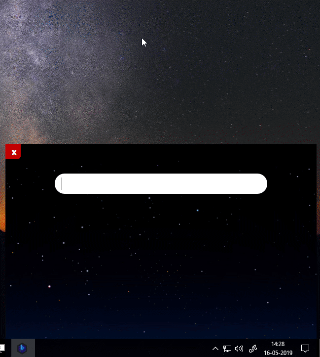
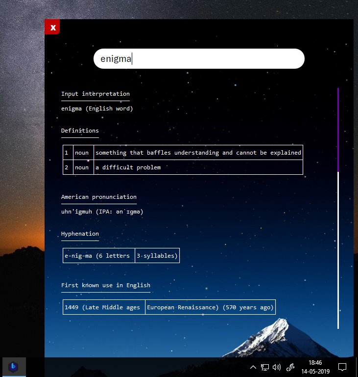

# BLU | VA
A user-friendly Virtual Assistant built on Wolfram|Alpha and Tensorflow with sleek PyQt5 GUI.

## OS Compatibility
- Windows 7(SP1)
- Windows 8, 8.1
- Windows 10
 
## Downloads
- [32-bit Download](https://github.com/NikhilCodes/VirtualBLU/raw/master/x86/BLU-x86-stable-27.05.19.rar)

## BLU Demo
  
Cool, Isn't it?

## Screenshot

 
Secret to vast knowledge is through Wolfram|Alpha Computational Engine.

---
# If you like my Project, then please do drop a ⭐
<iframe src="https://ghbtns.com/github-btn.html?user=nikhilcodes&repo=virtualblu&type=star&count=true&size=large" frameborder="0" scrolling="0" width="160px" height="30px"></iframe>

# Follow ME to stay tuned for MORE cool Projects
<iframe src="https://ghbtns.com/github-btn.html?user=nikhilcodes&type=follow&count=true&size=large" frameborder="0" scrolling="0" width="220px" height="30px"></iframe>

---

### Probable Error and How to Fix them!
- **Error #1** 
  This programme can't start because api-ms-win-crt-runtime-l1-1-0.dll is missing. Try to reinstall this. 
  **FIX** 
  You are probably running Windows 7 (Service pack 1 missing)
  The default solution is to install KB2999226 update of Microsoft.
  Or Install Windows 7(Service Pack 1 included) or higher!
  Then download and install Visual C++ Redistributable vc_redist.x64.exe

- **Error #2** 
  If you have downloaded 64bit version and the program runs and exits instantaneously. 
  **FIX** 
  You should try downloading 32bit version instead, it might work.
  As surprizingly enough, it did work for some users.
